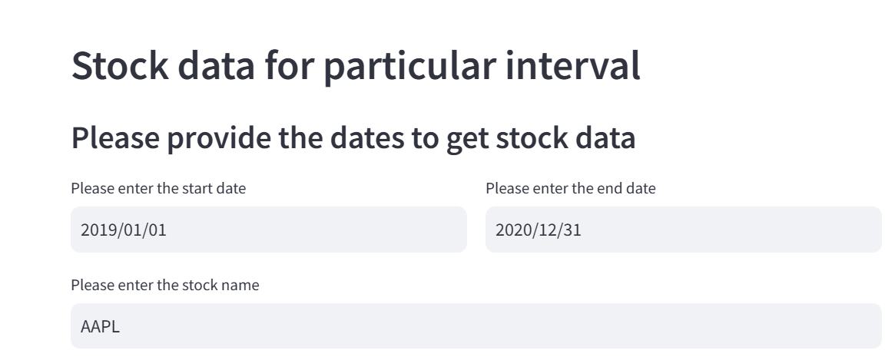

# **Installation**

    Before running the application, make sure you have Python installed. You will also need to install the required 
    libraries using pip:

# **Usage:**

To run the application, execute the following command in your terminal:
        **streamlit run <script_name>.py**
    
Replace <script_name> with the name of your Python script.

# **Features**

**Header and Subheader:** 
    The app displays a header titled "Stock data for particular interval" and a subheader prompting the user to provide dates.

**Date Input:** 
    Users can select a start date and an end date using the date picker widgets. The default start date is set to January 1, 2019, 
    and the default end date is set to December 31, 2020.

**Stock Ticker Input:** 
    The user can input the stock ticker symbol (e.g., 'AAPL' for Apple, 'GOOGL' for Alphabet) using a text input field.

**Display Data:** 
    Upon clicking the "Enter" button, the app fetches the historical stock data for the specified date range and displays it 
    in a table format.

**Line Chart:** 
    The application also generates a line chart of the stock's closing prices over the specified date range.

**Validation:** 
    If the user doesn't provide a valid stock ticker symbol, the app will prompt them to enter the correct short form of the stock.

**# Code Overview**

**Importing Libraries:** 
    The necessary libraries, including yfinance for fetching stock data and streamlit for creating the web application, are 
    imported.

**Setting Up the Header:** 
    The application starts by setting up the main header and subheader to guide the user.

**Date Selection:** 
    Two date input fields are provided for the user to select the start and end dates. These are placed in separate columns for a clean layout.

**Stock Ticker Input:** 
    A text input field allows the user to input the stock ticker symbol dynamically.

**Fetching and Displaying Data:** 
    When the "Enter" button is clicked, the application fetches historical stock data from Yahoo Finance using the yfinance library. The data is then displayed in a table, and a line chart of the closing prices is generated.

**Error Handling:** 
    If the user doesn't enter a valid stock ticker, the application prompts them to provide the correct symbol.

